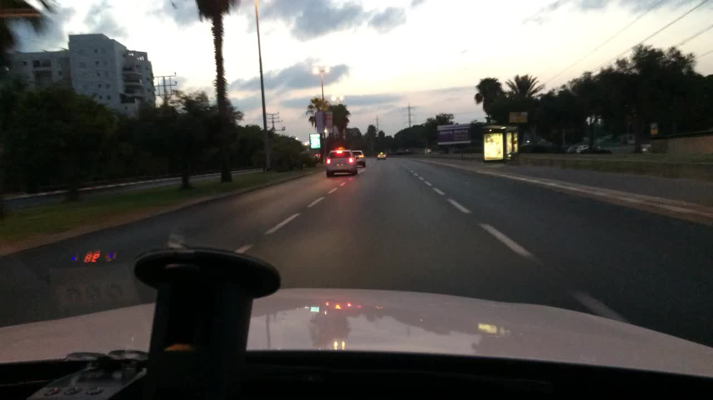
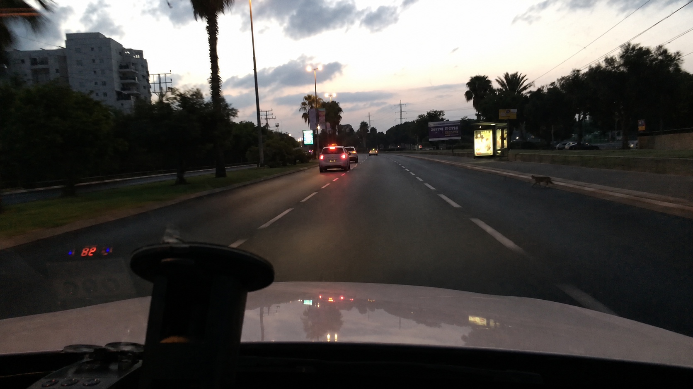

# CIFAR Synthetic Evidence Corpus for Detecting AI-Manipulated Images

A benchmark and dataset for **evidentiary image authentication** — evaluating whether photographic evidence is authentic, manipulated, or synthetic under conditions that resemble legal and institutional use.

---

## Example: a localized “add hazard” edit

The corpus targets manipulations that change *what an image appears to prove* while leaving the scene otherwise intact. Below is one item — a **Tier 2 (localized element edit)** from the dashcam family, subtype **`ADD-HAZARD`**, produced in the human-in-the-loop **Hero** set.

<table>
<tr>
<td align="center" width="50%"><b>Before — authentic source frame</b><br><sub><code>bdd100k_54cf14d6-9654cf25</code> · BDD100K</sub></td>
<td align="center" width="50%"><b>After — manipulated</b><br><sub><code>item_00328_dashcam_T2_hero_ChatGPT</code></sub></td>
</tr>
<tr>
<td></td>
<td></td>
</tr>
</table>

A small animal has been added at the right edge of the roadway. Everything else — the lead vehicle’s brake lights, the lane markings, the bus shelter, the skyline, and the dusk / overcast lighting — is preserved. That is exactly what makes this class of edit consequential and hard to detect: a single salient element changes what the frame would appear to show about a driving incident, while the rest of the scene reads as a normal photograph. This particular Hero item is among those that slip past even the strongest baseline detector.

**Prompt** (template `X-T2-ADD-HAZARD-DSH`, `param_hazard_type = small animal`, `param_location = the edge of the road`):

> Add a small animal to the roadway in this dashcam still, positioned at approximately the edge of the road. The hazard should appear at a scale and perspective consistent with the road surface and surrounding scene. Match the lighting, shadow direction, and weather of the original image. Keep all vehicles, road markings, signage, traffic lights, and pedestrians exactly as they appear. Make it look as photorealistic as possible. The hazard should look as if it had always been in that position.
---

## TL;DR

| | |
|---|---|
| **Total items** | 1,505 photographic items |
| **Authentic controls** | 720 |
| **Manipulated / fabricated** | 785 |
| **Evidentiary families** | Surveillance (`cctv`), dashcam, consumer photos (`phone`) |
| **Manipulation tiers** | T1 scene-condition · T2 localized element edit · T3 full fabrication |
| **Source datasets** | VIRAT, UCF-Crime (normal subset), BDD100K, CASIA v2.0 |
| **Generators** | Three consumer generative systems (released anonymized as variants `A`/`B`/`C`) + a human-in-the-loop **Hero** set |
| **Per-item metadata** | Source provenance, scene attributes, tier/subtype, generator variant, prompt template + filled prompt, train/test pool |
| **Baselines** | Zero-shot evaluation of D3, UnivFD, DRCT, CNNSpot via the DetectZoo framework |

The headline message of the benchmark: **off-the-shelf synthetic-image detectors transfer poorly to localized, consumer-tool evidentiary manipulations**, and their default operating points produce false-positive rates on authentic images that are unacceptable for courtroom use.

---

## Why this corpus exists

Courts increasingly receive photographs whose authenticity cannot be taken for granted — surveillance frames offered to show presence, dashcam stills used to reconstruct incidents, and phone photos submitted to document damage, injury, or the condition of a scene. Contemporary generative systems let non-experts alter or fabricate such images through ordinary prompt-based interfaces.

Existing image-forensics benchmarks were built around a different object of authentication (faces, generic natural images) and a different manipulation model (classical splicing/copy-move, or whole-image GAN/diffusion synthesis). This corpus is organized instead around:

- **The forms of visual evidence submitted in courts** (surveillance, dashcam, consumer photos).
- **Localized edits that change what an exhibit appears to prove** while leaving most of the scene intact (e.g., removing a person, changing a sign, adding visible damage).
- **A consumer-tool threat model** — a non-expert requesting a single scoped change through an ordinary interface.
- **Structured metadata** that supports diagnostic evaluation by family, tier, subtype, generator, and prompt — not just aggregate binary accuracy.

It is a **complement to**, not a replacement for, existing forensics benchmarks.

---

## Repository structure

```
Synthetic-Evidence-Image-Corpus/
├── Manipulated-Images/                      # T1/T2/T3 manipulated & fabricated images
├── Source-Images/                           # Authentic source frames / authentic controls
├── image_corpus_manifest.csv              # Per-item metadata manifest (CSV)
├── image_corpus_manifest.parquet            # Per-item metadata manifest (Parquet)
├── dataset_analysis.ipynb                   # Notebook: corpus statistics + benchmark analysis
├── dataset_analysis_outputs/                # Figures and tables produced by the notebook
└── detectzoo_results/                       # Per-detector zero-shot benchmark outputs (DetectZoo)
```

The **`.parquet`** and **`.csv`** manifests contain the same per-item records; use whichever your tooling prefers. The Parquet file is the recommended authoritative copy (faster to load, preserves dtypes, and is date-stamped to the build it describes).

---

## Dataset design

The corpus varies along four axes so that detector behavior can be measured under realistic conditions rather than as a single aggregate score.

### 1. Evidentiary families

| Family | Manifest label | Source dataset(s) | Notes |
|---|---|---|---|
| Surveillance | `cctv` | VIRAT, UCF-Crime (normal-activity subset) | Drawn from **two** sources so detectors cannot use a single dataset’s visual signature as a proxy for authenticity |
| Dashcam | `dashcam` | BDD100K | One keyframe sampled per clip |
| Consumer photos | `phone` | CASIA v2.0 | Each CASIA image treated as one candidate frame |

These families differ in viewpoint, compression, resolution, scene structure, and evidentiary function.

### 2. Manipulation tiers

| Tier | What changes | Description |
|---|---|---|
| **T1 — Scene conditions** | Global context | Time of day, weather, lighting, or crowd density changes, with main scene content preserved |
| **T2 — Localized element edit** | A salient element | Insert / remove / change an evidentially salient element (person, vehicle, sign, hazard, visible damage) |
| **T3 — Full fabrication** | Everything | A complete image generated from a text prompt with **no** source frame |

### 3. Subtypes

Subtypes are recorded per item in `t1_subtype` / `t2_subtype`.

- **T1 subtypes:** `TIME`, `WEATHER`, `LIGHTING`, `CROWD`
- **T2 subtypes (by family):**

| Surveillance (`cctv`) | Dashcam | Consumer (`phone`) |
|---|---|---|
| Swap object · Remove person · Remove signage · Add person | Remove sign · Traffic-light color · Remove vehicle · Add hazard | Add object · Remove damage · Swap object · Add damage |

(The manifest encodes these with short codes, e.g. `REMOVE-PERSON`, `LIGHT-COLOR`, `SWAP-OBJECT-CCT`, `ADD-DAMAGE`.)

### 4. Generators

T1/T2 items apply a prompt template to an assigned authentic source frame; T3 items are generated from the prompt alone. The corpus uses **three consumer-accessible generative systems from multiple organizations** so results don’t depend on a single model’s artifacts. In the released data these are **anonymized as variants `A`, `B`, and `C`** (`assigned_variant`).

A smaller **Hero** set models a higher-effort adversary willing to manually refine an image through iterative human-in-the-loop editing (tagged `Photoshop` / `ChatGPT` in `assigned_variant`, flagged via `hero_candidate`). Where the single-pass variants model ordinary manipulation, the Hero set probes what a motivated, hands-on adversary can achieve.

### Prompts

Generation is driven by a fixed set of prompt templates (27 templates spanning the three families and three tiers). Each template models a non-expert requesting a **single scoped change** and asks the model to preserve all other scene content. Every item’s template and the concrete filled prompt are stored in the manifest (`assigned_prompt_template`, `assigned_prompt_filled`).

---

## The metadata manifest

The manifest is the heart of the resource. Each manipulated/fabricated item is one row, with **65 columns** capturing provenance, scene attributes, manipulation parameters, and the exact prompt used. Grouped by purpose:

**Identity & provenance**
`assigned_item_id`, `frame_id`, `dataset` (source pool, incl. `fabricated` for T3), `source_video_id`, `frame_seconds`, `width`, `height`, `pool` (train/test), `assigned_batch_id`, `assigned_quota`

**Manipulation label**
`family`, `tier`, `assigned_variant` (generator), `t1_subtype`, `t2_subtype`, `assigned_prompt_template`, `assigned_prompt_filled`, `flagged`, `flagged_reason`, `hero_candidate`

**Scene attributes (auto-tagged on the source frame)**
`time_of_day`, `weather`, `lighting_type`, `is_indoor`, `people_count_bucket`, `has_clearly_visible_person`, `has_open_floor_or_ground_space`, `person_holding_object`, `has_wall_signage_visible`, `has_traffic_light_visible`, `traffic_light_state`, `has_stop_sign_visible`, `has_road_sign_visible`, `has_clear_road_ahead`, `vehicle_count_in_scene`, `has_visible_damage`, `has_undamaged_surface_target`, `has_handheld_object_visible`, `has_open_surface_space`

**Manipulation targets & parameters**
`target_time`, `target_weather`, `target_lighting`, `target_crowd`, and the `param_*` family (e.g. `param_original_object`, `param_new_object`, `param_person_reference`, `param_signage_type`, `param_current_color`, `param_target_color`, `param_hazard_type`, `param_vehicle_description`, `param_damage_type`, `param_object_description`, `param_scene_type`, …) — the slot values that filled each prompt template.

> **Note on counts.** The released manifest records the manipulated/fabricated items (the build dated 2026-06-04 contains 796 rows, including a small number of `flagged` items and the Hero candidates). The authentic controls (720) live in `Source-Images/`. The paper’s headline figures (720 authentic + 785 manipulated = 1,505) are the corpus totals used for evaluation; treat the manifest as the authoritative per-item record.

### Loading the manifest

```python
import pandas as pd

# Recommended: Parquet
df = pd.read_parquet("image_corpus_manifest.parquet")

# Or Excel
# df = pd.read_excel("image_corpus_manifest.xlsx")

print(df.shape)                       # rows x 65 columns
print(df["family"].value_counts())    # cctv / dashcam / phone
print(df["tier"].value_counts())      # T1 / T2 / T3
print(df["pool"].value_counts())      # train / test

# Example: every T2 "remove person" surveillance edit
mask = (df["family"] == "cctv") & (df["t2_subtype"] == "REMOVE-PERSON")
subset = df[mask]
```

---

## Benchmark

We evaluate publicly available image-manipulation detectors **zero-shot** on the full corpus using the [DetectZoo](https://github.com/) framework. Each detector scores every image once using its released weights and **default decision threshold**, with no fine-tuning. We report both threshold-free metrics (ROC-AUC, PR-AUC), which rank detectors independently of any operating point, and threshold-dependent metrics (accuracy, precision, recall, FPR) at each detector’s shipped default. The task is binary authentication over all 1,505 items.

| Detector | Acc. | Prec. | Rec. | FPR | ROC-AUC | PR-AUC |
|---|---|---|---|---|---|---|
| **D3** (diffusion reconstruction) | 0.616 | 0.696 | 0.469 | 0.224 | **0.674** | 0.684 |
| **UnivFD** (CLIP-feature classifier) | 0.573 | 0.686 | 0.336 | 0.168 | 0.643 | 0.633 |
| **DRCT** (diffusion-reconstruction contrastive) | 0.535 | 0.647 | 0.238 | 0.141 | 0.621 | 0.642 |
| **CNNSpot** (CNN GAN-artifact detector) | 0.478 | 0.500 | 0.003 | 0.003 | 0.639 | 0.587 |

**Takeaways**

- The best detector (D3) reaches only **0.674 ROC-AUC**; the rest sit near chance.
- At its shipped threshold, D3 catches **fewer than half** of manipulations (≈47% recall) while wrongly flagging **22% of authentic images** — and falsely impugning genuine evidence is the more damaging error in court.
- Detectability is uneven in ways that track evidentiary structure: **dashcam is markedly harder** than surveillance or consumer photos, the weakest cell being **dashcam T3 fabrication**; per-generator recall varies sharply; and the **Hero (human-refined) set largely defeats the detector**, with the lowest-scoring manipulated image receiving a manipulation score of ~0.04.

A benchmark for evidentiary authentication must report this **error structure**, not only aggregate accuracy. Per-detector outputs are in `detectzoo_results/`; the breakdowns and figures are reproduced in `dataset_analysis.ipynb` → `dataset_analysis_outputs/`.

---

## Reproducing the analysis

```bash
# 1. Clone
git clone https://github.com/UofT-CIFAR/Synthetic-Evidence-Image-Corpus.git
cd Synthetic-Evidence-Image-Corpus

# 2. Environment (suggested)
pip install pandas pyarrow openpyxl jupyter matplotlib seaborn

# 3. Open the analysis notebook
jupyter notebook dataset_analysis.ipynb
```

The notebook regenerates the corpus-composition statistics and the per-family / per-tier / per-generator benchmark breakdowns into `dataset_analysis_outputs/`.

---

## Source data and licensing

The manipulated images are **derived from** publicly available source datasets, each of which carries its own license and terms of use. Anyone using this corpus must comply with the original terms of:

- **VIRAT** (surveillance video)
- **UCF-Crime** (surveillance video — normal-activity subset)
- **BDD100K** (driving scenes)
- **CASIA v2.0** (consumer photographs)

---

## Intended use, limitations, and responsible use

**Intended use.** A research benchmark for studying the reliability, failure modes, and limits of image-authentication systems in settings aligned with evidentiary practice — including information integrity, provenance, verification, and trustworthy-AI research.

**Not a forensic tool.** This corpus supports *evaluation* of detectors. It does not establish that any detector is fit for use as evidence, and detection alone does not resolve the legal problem of authenticating exhibits. Nothing here should be presented in a legal proceeding as a validated forensic instrument.

**Limitations.**
- Built around a single-pass, consumer-tool threat model plus a small high-effort Hero set; it does not exhaust the space of possible manipulations.
- Scene attributes were auto-tagged with a vision model and may contain labeling noise.
- Generator coverage is limited to a snapshot of contemporary consumer systems; detectability will shift as models evolve.
- The corpus is derived from specific source domains and may not transfer to other imaging conditions.

**Responsible use.** The manipulated images are fabricated and must not be presented as depictions of real events. Use them only for research on detection, authentication, and information integrity.

---

## Citation

If you use this corpus, please cite the paper:

```bibtex
@inproceedings{mcconvey2026synthetic,
  title     = {A Benchmark and Dataset for Detecting AI-Manipulated Visual Evidence in the Court System},
  author    = {McConvey, Kelly and Ebrahimi, Sajad and Mahdavimoghaddam, Jalehsadat and
               Jamali, Nima and Mahdizadeh Sani, Matina and Zhang, Wentao and Deng, Yuntian and
               Grossman, Maura and Taranukhin, Maksym and Shwartz, Vered and
               Burkell, Jacquelyn and Eltis, Karen and Bagheri, Ebrahim},
  <!-- booktitle = {Proceedings of the 35th ACM International Conference on Information and Knowledge Management (CIKM '26)},
  year      = {2026},
  address   = {Rome, Italy},
  publisher = {ACM},
  doi       = {10.1145/XXXXXXX.XXXXXXX} -->
}
```

## Acknowledgements

This work was supported by the *Safeguarding Courts from Synthetic AI Content* Solution Network, funded through the **Canadian AI Safety Institute (CAISI) Research Program at CIFAR**.

---

## Contact

For questions or issues, please open an issue on this repository.
